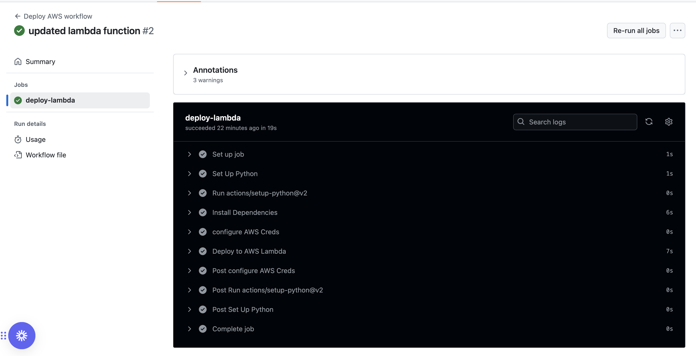

# AWS Lambda CI/CD Pipeline with GitHub Actions

## Project Overview
This project demonstrates an automated CI/CD pipeline for serverless applications using AWS Lambda and GitHub Actions. The pipeline enables automatic deployment of code changes to AWS Lambda when updates are pushed to the main branch, showcasing a modern DevOps approach to serverless development.

## Project Components
- **AWS Lambda Function**: Serverless compute service for running code
- **GitHub Actions**: Automated CI/CD pipeline
- **AWS CLI**: Command line tool for AWS service interaction
- **Python 3.12**: Runtime environment for the Lambda function

## Development Environment Setup
The local development environment was configured using VS Code with AWS toolkit integration, enabling seamless Lambda function development and testing.

## CI/CD Pipeline Implementation
The GitHub Actions workflow automatically deploys code changes to AWS Lambda when updates are pushed to the main branch. The pipeline includes:

1. Code checkout
2. Python environment setup
3. AWS credentials configuration
4. Lambda function deployment

### Successful Deployment
The automated pipeline ensures consistent and reliable deployments to AWS Lambda.

## Project Structure
.
├── .github/
│ └── workflows/
│ └── lambda.yml
├── lambda/
│ ├── requirements.txt
│ └── lambda function files
├── images/
│ └── project screenshots
└── README.md

## Security Implementation
- AWS credentials stored securely in GitHub Secrets
- IAM roles configured with least privilege principle
- Secure credential handling in CI/CD pipeline

## Setup Instructions

### Prerequisites
1. AWS Account
2. GitHub Account
3. Python 3.12
4. AWS CLI

### Configuration Steps
1. Create AWS Lambda function
2. Configure GitHub repository
3. Set up GitHub Secrets:
   - AWS_ACCESS_KEY_ID
   - AWS_SECRET_ACCESS_KEY
4. Configure GitHub Actions workflow

## Future Enhancements
This foundation can be extended to include:
- Multi-environment deployments (Dev, Staging, Prod)
- Automated testing integration
- Additional AWS service integrations
- Enhanced security measures
- Monitoring and alerting

## Best Practices
- Regular code testing before deployment
- Monitoring GitHub Actions logs
- AWS Lambda function logging review
- Security best practices implementation

## Troubleshooting
Common issues and solutions:
1. **Deployment Failures**
   - Verify AWS credentials
   - Check IAM permissions
   - Review GitHub Actions logs

2. **Lambda Function Issues**
   - Check function configuration
   - Review CloudWatch logs
   - Verify IAM roles

## Skills Acquired
- **AWS Lambda Configuration**: Creating and managing serverless functions
- **GitHub Actions**: Setting up and configuring CI/CD workflows
- **IAM Security**: Managing AWS credentials and permissions
- **Python Development**: Writing and deploying Python-based Lambda functions
- **DevOps Practices**: Implementing automated deployment pipelines
- **Version Control**: Advanced Git operations and branch management
- **Cloud Security**: Secure handling of credentials and secrets
